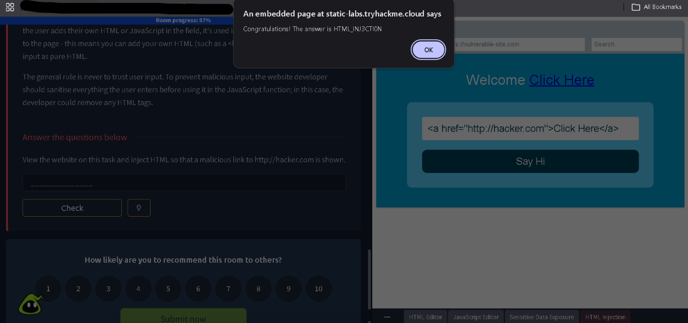
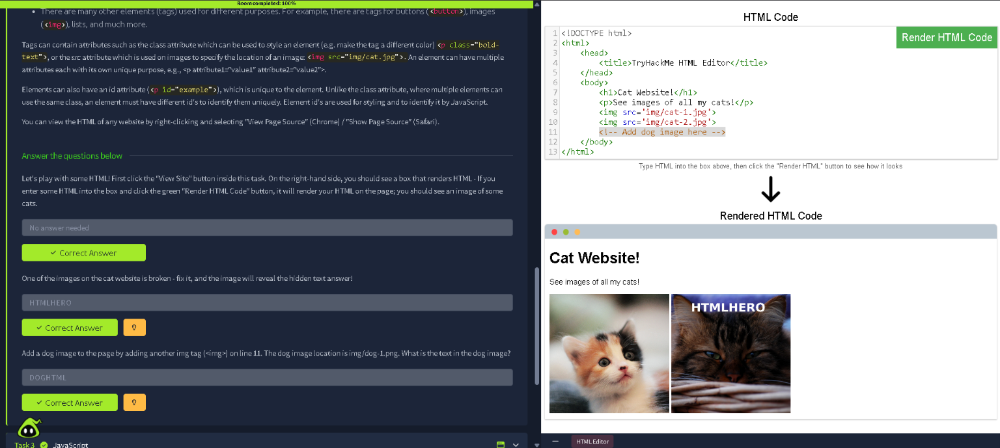
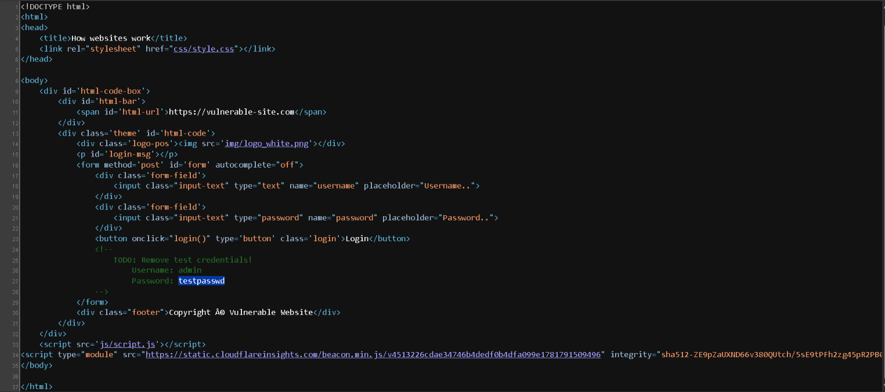
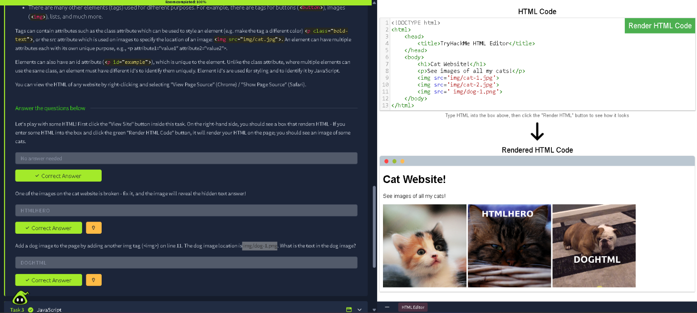
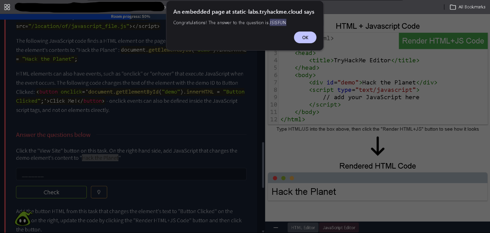

# TryHackMe: How Websites Work — Writeup

**Room:** [How Websites Work](https://tryhackme.com/room/howwebsiteswork) · Pre Security → How The Web Works
**Difficulty:** Info / Beginner
**Status:** ✅ Room completed — 100%

## Overview

This room covers the fundamentals of how websites are built and served — the browser/server request-response cycle, front-end vs back-end, HTML structure, and a first taste of client-side vulnerabilities like sensitive data exposure, HTML injection, and JavaScript injection.

---

## Task — How Does the Internet Work?

When you visit a website, your browser sends a request to a web server asking for the page's data. The server processes that request and sends back a response, which the browser then renders.



A website is made of two major components:
- **Front End (Client-Side)** — how the browser renders the site
- **Back End (Server-Side)** — the server that processes requests and returns responses

**Answer:**
| Question | Answer |
|---|---|
| What term best describes the component of a web application rendered by your browser? | `Front End` |

---

## Task — HTML Basics: Tags, Attributes & IDs

HTML elements are built from tags (`<button>`, ``, etc.) which can carry attributes — like `class` for styling or `src` to point an `` tag at an image file. Elements can also carry a unique `id` attribute, used both for styling and for JavaScript to target a specific element.


Using the built-in HTML editor, I rendered a sample "Cat Website" page. One of the images was broken — fixing the `src` path revealed hidden text embedded in the image itself.

**Answer:**
| Question | Answer |
|---|---|
| Fix the broken image — what hidden text does it reveal? | `HTMLHERO` |

### Adding a new element

I then added a new `` tag on line 11 pointing to `img/dog-1.png`, which rendered a dog image containing its own hidden text.



**Answer:**
| Question | Answer |
|---|---|
| What is the text in the dog image? | `DOGHTML` |

---

## Task — Sensitive Data Exposure

Viewing the page source of a mock vulnerable login site revealed a developer had left test credentials behind in an HTML comment, meant to be removed before going live (`TODO: Remove test credentials!`).



**Key finding:** Hardcoded credentials (`admin` / `testpasswd`) left in a client-side HTML comment — a classic sensitive data exposure issue, since anything shipped to the browser is visible to any user via "View Page Source."

---

## Task — HTML Injection

Since HTML rendered client-side is only as trustworthy as its input sanitization, injecting raw HTML into an unsanitized field lets an attacker alter the page — for example, adding a malicious link.

I injected `<a href="http://hacker.com">Click Here</a>` into the vulnerable input field, and the page rendered it as a live clickable link.



**Flag:** `HTML_INJ3CTI0N`

**Key takeaway:** the fix is to sanitize user input server- and client-side (e.g. stripping or escaping HTML tags) before rendering it back to other users.

---

## Task — JavaScript Injection

Extending the same idea to JavaScript: using the live HTML+JS editor, I added a script that grabs an element by its `id` and overwrites its content —

```javascript
document.getElementById("demo").innerHTML = "Hack the Planet";
```

Rendering this confirmed the `<div id="demo">` element's text was successfully overwritten client-side.



**Flag:** `JSISFUN`

---

## Summary

This room built a foundation for how the web actually works — client/server request-response flow, HTML structure and attributes, and a first look at how unsanitized data flowing into HTML/JS rendering can be abused (sensitive data exposure, HTML injection, JS injection).

**Room completion: 100%** ✅

**Key takeaways:**
- Front end vs back end split: anything rendered client-side (including comments, JS, and hidden fields) is fully visible to the end user — never store secrets there.
- HTML/JS injection are two sides of the same root cause: unsanitized user input reflected back into a page. Escaping/sanitizing input is the fix in both cases.
- "View Page Source" and the browser console/editor are the first tools to reach for when triaging how a page is actually built and where it might be trusting user input too much.
